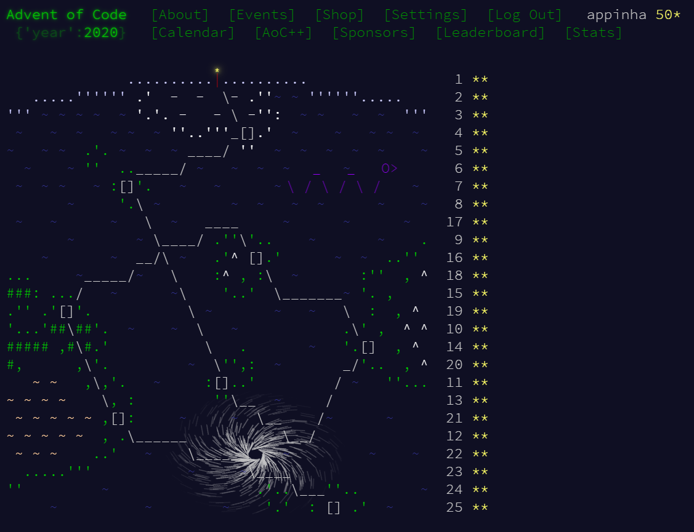
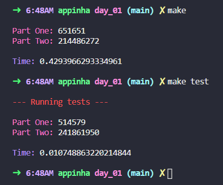
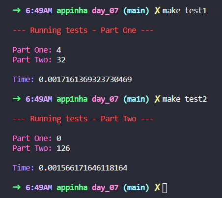

<h1 align="center">
	🌟 Advent of Code 2020 🎄
</h1>

	<i>My solutions for <b>Advent of Code 2020</b>.</i>

	
	
	
	
	

<h3 align="center">
	<a href="#%EF%B8%8F-about">About</a>
	 · 
	<a href="#-what-is-advent-of-code">What is <i>Advent of Code</i>?</a>
	 · 
	<a href="#-contents">Contents</a>
	 · 
	<a href="#%EF%B8%8F-usage">Usage</a>
	 · 
	<a href="#%EF%B8%8F-table-of-puzzles">Table of puzzles</a>
</h3>

---

## 🗣️ About

This is the **first time** I participate in the event and have greatly enjoyed it! So much fun and learning in the process 😀

I had little Python experience (and no formal education in CS) prior to Advent of Code 2020 and after completing all 25 puzzles in full I feel very confident about my recently acquired skills. It allowed me to deepen my knowledge of Python's data structures, learn to use many handy libraries and tools, and even develop a personal style for coding in Python.

A delightful surprise was to experience in practical terms the concepts of algorithm and data structure analysis (computational complexity). Some puzzles force the writing of efficient and well thought code in order to obtain a result within a reasonable amount of time, thus promoting a valuable opportunity to evidence the importance of such intelligence.

I tried following some **principles** when developing my solutions:

* write well structured, readable and scalable code;
* explore features and tools from the programming language;
* take advantage of standard and widely used libraries.

Finally, I'm ecstatic for **completing** the puzzles within 24 days (I started only on the 6th) and learning this much in such a short amount of time! I have become a fan of the event and will definitely continue to participate and even try to complete the other years' puzzles 😁

## 🌟 What is *Advent of Code*?

	🚀 TLDR: an online event where a two-part programming puzzle is released each day from Dec 1st to 25th.

[Advent of Code](http://adventofcode.com) is an online event created by [Eric Wastl](http://was.tl/). In his words:

> Advent of Code is an Advent calendar of small programming puzzles for a variety of skill sets and skill levels that can be solved in any programming language you like. People use them as a speed contest, interview prep, company training, university coursework, practice problems, or to challenge each other.

*Source: https://adventofcode.com/about*

### 🎄 This year story for the puzzles

> After saving Christmas [five years in a row](https://adventofcode.com/events), you've decided to take a vacation at a nice resort on a tropical island. Surely, Christmas will go on without you.
>
> The tropical island has its own currency and is entirely cash-only. The gold coins used there have a little picture of a starfish; the locals just call them **stars**. None of the currency exchanges seem to have heard of them, but somehow, you'll need to find fifty of these coins by the time you arrive so you can pay the deposit on your room.
>
>To save your vacation, you need to get all **fifty stars** by December 25th.
>
>Collect stars by solving puzzles. Two puzzles will be made available on each day in the Advent calendar; the second puzzle is unlocked when you complete the first. Each puzzle grants **one star**. Good luck!

## 📑 Contents

My solutions for the puzzles are available in the folder [📁 my_solutions](my_solutions) and are organized into subfolders for each day of the event. There is also a subfolder called [📁 common_core](common_core) containing the main framework developed to streamline coding of puzzle solutions.

Inside each subfolder, the following files can be found:

* `input_test.txt` - text file containing input from tests given in the puzzle.
* `input.txt` - text file containing my personal input for the puzzle.
* `main.py` - Python code for solving the puzzle.
* `Makefile` - script for running the puzzle solving code.

## 🛠️ Usage

Inside each `day_*` folder, run `make` to get the solution for my personal input for the puzzle or `make test` to get solutions for the tests given in the puzzle.

Some puzzles have different test input for each part; in this case, run `make test1` fort Part One's test and `make test2`for Part Two's test.

## 🗓️ Table of puzzles

| DAY							| PUZZLE TITLE					| PUZZLE SUMMARY
| :-:							| :-							| :-
| [📁 01](my_solutions/day_01)	| **Report Repair**				| 📃 **Input:** expense report - i.e. list of integer numbers. ⭐ **Part One:** find the 2 entries (numbers) that sum to 2020, then multiply them together.  ⭐ **Part Two:** find the 3 entries (numbers) that sum to 2020, then multiply them together.
| [📁 02](my_solutions/day_02)	| **Password Philosophy**		| 📃 **Input:** list of passwords and the corporate policy when that password was set (e.g. `1-3 a: abcde`). ⭐ **Part One:** count how many passwords are valid according to the policies.  ⭐ **Part Two:** count how many passwords are valid according to the new interpretation of the policies.
| [📁 03](my_solutions/day_03)	| **Toboggan Trajectory**		| 📃 **Input:** map of open squares (`.`) and trees (`#`). ⭐ **Part One:** count how many trees would be encountered when traversing the map with given slope rules.  ⭐ **Part Two:** same thing as Part One, but for list of various slopes; multiply together the number of trees encountered on each of these slopes.
| [📁 04](my_solutions/day_04)	| **Passport Processing**		| 📃 **Input:** batch file with passport data. ⭐ **Part One:** count how many passports are _valid_ - those that have all required fields.  ⭐ **Part Two:** count how many passports are _valid_ - those that have all required fields AND valid values.
| [📁 05](my_solutions/day_05)	| **Binary Boarding**			| 📃 **Input:** list of boarding passes (e.g. `FBFBBFFRLR`). ⭐ **Part One:** find the highest _seat ID_ - which is calculated by `row_int * 8 + col_int`.  ⭐ **Part Two:** find the ID of my seat (which is the only one missing from the list).
| [📁 06](my_solutions/day_06)	| **Custom Customs**			| 📃 **Input:** answers from customs declaration form collected from every group on the plane. ⭐ **Part One:** sum of counts of number of questions to which _anyone_ answered "yes".  ⭐ **Part Two:** sum of counts of number of questions to which _everyone_ answered "yes".
| [📁 07](my_solutions/day_07)	| **Handy Haversacks**			| 📃 **Input:** bag rules (for luggage processing). ⭐ **Part One:** count how many bag colors can eventually contain at least one `shiny gold` bag.  ⭐ **Part Two:** count how many individual bags are required inside your single `shiny gold` bag.
| [📁 08](my_solutions/day_08)	| **Handheld Halting**			| 📃 **Input:** boot code for handheld game console. ⭐ **Part One:** get value in the accumulator after one loop of the infinte loop.  ⭐ **Part Two:** fix  the program (correct the infinite loop by changing a single instruction) and get value in the accumulator after program terminates.
| [📁 09](my_solutions/day_09)	| **Encoding Error**			| 📃 **Input:** data encrypted with the _eXchange-Masking Addition System_ (XMAS) - i.e. list of numbers (integers). ⭐ **Part One:** find invalid number - i.e. first number which is _not_ the sum of two of the 25 numbers before it.  ⭐ **Part Two:** find the encryption weakness - i.e. sum of smallest and largest numbers of contiguous set of at least two numbers which sum to the invalid number.
| [📁 10](my_solutions/day_10)	| **Adapter Array**				| 📃 **Input:** list of output joltage of adapters - i.e. list of numbers (integers). ⭐ **Part One:** count the occurrence of 1-jolt and 3-jolt differences in chain that uses all adapters - i.e. sorted list of numbers - and multiply together these two numbers of occurrence.  ⭐ **Part Two:** find the total number of distinct ways the adapters can be arranged to connect the charging outlet to the device - i.e. combinatorial analysis of sorted list of numbers.
| [📁 11](my_solutions/day_11)	| **Seating System**			| 📃 **Input:** map of the seat layout (`.` for floor, `L` for empty seat and `#` for occupied seat) at waiting area to board the ferry. ⭐ **Part One:** simulate seating rules repeatedly until no seats change state anymore - i.e. equilibrium is reached; count how many seats end up occupied.  ⭐ **Part Two:** given the new visibility method and the rule change for occupied seats becoming empty, count how many seats end up occupied when equilibrium is reached.
| [📁 12](my_solutions/day_12)	| **Rain Risk**					| 📃 **Input:** navigation instructions - i.e. sequence of single-character actions (`N`, `S`, `E`, `W`, `L`, `R`, `F`) paired with integer input values (e.g. `F10`). ⭐ **Part One:** figure out where the navigation instructions lead; calculate the _Manhattan distance_ (sum of the absolute values of its east/west position and its north/south position) between that location and the ship's starting position.  ⭐ **Part Two:** figure out where the navigation instructions _actually_ lead - i.e. with new action meanings; calculate the _Manhattan distance_ between that location and the ship's starting position.
| [📁 13](my_solutions/day_13)	| **Shuttle Search**			| 📃 **Input:** notes on the shuttle bus service - i.e. two lines: estimate of the earliest timestamp you could depart on a bus; list of bus IDs that are in service according to the shuttle company (`x` entries are out of service). ⭐ **Part One:** find ID of the earliest bus you can take to the airport multiplied by the number of minutes you'll need to wait for that bus.  ⭐ **Part Two:** find the earliest timestamp such that all of the listed bus IDs depart at offsets matching their positions in the list.
| [📁 14](my_solutions/day_14)	| **Docking Data**				| 📃 **Input:** initialization program - i.e. list of bitmasks (e.g. `mask = XXXXXXXXXXXXXXXXXXXXXXXXXXXXX1XXXX0X`) and pair of memory address with integer input values (e.g. `mem[8] = 11`). ⭐ **Part One:** execute the initialization program; sum all values left in memory after it completes.  ⭐ **Part Two:** execute the initialization program using an emulator for a version 2 decoder chip; sum of all values left in memory after it completes.
| [📁 15](my_solutions/day_15)	| **Rambunctious Recitation**	| 📃 **Input:** list of starting numbers - i.e. list of comma-separated integers (e.g. `0,3,6`). ⭐ **Part One:** play the Elves' memory game and find the `2020`th number spoken.  ⭐ **Part Two:** play the Elves' memory game and find the `30000000`th number spoken.
| [📁 16](my_solutions/day_16)	| **Ticket Translation**		| 📃 **Input:** three blocks of data: (1) rules for ticket fields - i.e. list of fields that exist somewhere on the ticket and the valid ranges of values for each field; (2) numbers on your ticket; (3) list of numbers on other nearby tickets for the same train service. ⭐ **Part One:** calculate ticket scanning error rate - i.e. sum of all of the invalid values in list of nearby tickets.  ⭐ **Part Two:** discard invalid tickets in list of nearby tickets; use the remaining valid tickets to determine which field is which; look for the six fields on your ticket that start with the word departure and multiply those six values together.
| [📁 17](my_solutions/day_17)	| **Conway Cubes**				| 📃 **Input:** initial state of the pocket dimension - i.e. grid with flat region of cubes (`.` for inactive cubes and `#` for active cubes). ⭐ **Part One:** simulate the six-cycle boot process in 3-dimensional space; count how many cubes are left in the active state after the sixth cycle.  ⭐ **Part Two:** simulate the six-cycle boot process in 4-dimensional space; count how many cubes are left in the active state after the sixth cycle.
| [📁 18](my_solutions/day_18)	| **Operation Order**			| 📃 **Input:** math homework of child sitting next to you - i.e. series of expressions that consist of addition (`+`), multiplication (`*`), and parentheses (`(...)`). ⭐ **Part One:** evaluate the expression on each line of the homework with changed rules of operator precedence - i.e. the `+` and `*` operators have the _same_ precedence; get the sum of the resulting values of each line. ⭐ **Part Two:** same as Part One, but with new rules of operator precedence - i.e. `+` has _more_ precedence than `*`.
| [📁 19](my_solutions/day_19)	| **Monster Messages**			| 📃 **Input:** two blocks of data: (1) rules for valid messages; (2) list of received messages the Elves have collected from their satellite. ⭐ **Part One:** find how many messages completely match rule 0.  ⭐ **Part Two:** same as Part One, but with updated rules (now, the rules _do_ contain loops).
| [📁 20](my_solutions/day_20)	| **Jurassic Jigsaw**			| 📃 **Input:** array of image tiles along with a random unique ID number. ⭐ **Part One:** assemble the tiles into an image; multiply together the IDs of the four corner tiles.  ⭐ **Part Two:** count how many `#` in assembled image are not part of a sea monster.
| [📁 21](my_solutions/day_21)	| **Allergen Assessment**			| 📃 **Input:** list of foods - i.e. food's ingredients list followed by some or all of the allergens the food contains (e.g. `sqjhc fvjkl (contains soy)`). ⭐ **Part One:** determine which ingredients cannot possibly contain any of the allergens in your list; count how many times do any of those ingredients appear.  ⭐ **Part Two:** find your canonical dangerous ingredient list - i.e. comma-separated list of ingredients sorted alphabetically by their allergen.
| [📁 22](my_solutions/day_22)	| **Crab Combat**				| 📃 **Input:** card decks of two players - i.e. two lists of integers. ⭐ **Part One:** play the card game (Combat); get the winning player's score - i.e. card values multiplied by their order in the winning deck.  ⭐ **Part Two:** play the Recursive Combat game; get the winning player's score.
| [📁 23](my_solutions/day_23)	| **Crab Cups**					| 📃 **Input:** cups' labels (integers). ⭐ **Part One:** simulate `100` moves of _crab's cup game_ with given cups (total of `9`) and get labels on the cups after cup `1`.  ⭐ **Part Two:** simulate ten million (`10000000`) moves of _crab's cup game_ with one million (`1000000`) cups and get product of the two cup labels immediately clockwise (after) cup `1`.
| [📁 24](my_solutions/day_24)	| **Lobby Layout**				| 📃 **Input:** list of the tiles that need to be flipped over, in the form of hex grid directions (`e`, `se`, `sw`, `w`, `nw`, and `ne`). ⭐ **Part One:** count how many tiles are left with the black side up after parsing the input - i.e. after going through the renovation crew's list and determining which tiles they need to flip.  ⭐ **Part Two:** count how many tiles will be black after 100 days of living art exhibit of lobby's tile floor.
| [📁 25](my_solutions/day_25)	| **Combo Breaker**				| 📃 **Input:** pair of public keys. ⭐ **Part One:** find encryption key of handshake.
